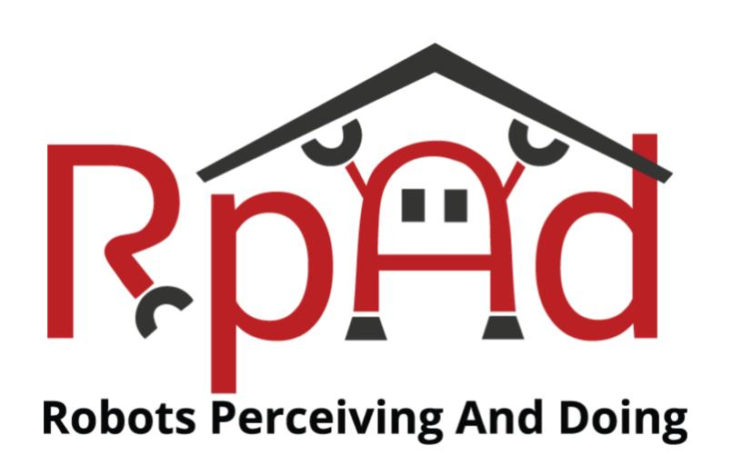

<h1 align="center">
  Learning to Singulate Layers of Cloth using Tactile Feedback
</h1>

<div align="center">
  <a href="https://sashank-tirumala.github.io/">Sashank Tirumala*</a> &nbsp;•&nbsp;
  <a href="https://thomasweng.com/">Thomas Weng*</a> &nbsp;•&nbsp;
  <a href="https://www.cs.cmu.edu/~dseita/">Daniel Seita*</a> &nbsp;•&nbsp;
  <a href="https://www.ri.cmu.edu/ri-faculty/oliver-kroemer/">Oliver Kroemer</a> &nbsp;•&nbsp;
  <a href="https://www.ri.cmu.edu/ri-faculty/zeynep-temel/">Zeynep Temel</a> &nbsp;•&nbsp;
  <a href="https://davheld.github.io/">David Held</a>
</div>

<h4 align="center">
  <a href="https://sites.google.com/view/reskin-cloth/home"><b>Website</b></a> &nbsp;•&nbsp;
  <a href="https://arxiv.org/abs/2207.11196"><b>Paper</b></a> 
</h4>


<div align="center">


[](https://opensource.org/licenses/MIT) &nbsp; [](https://github.com/psf/black) &nbsp;&nbsp;&nbsp;&nbsp;&nbsp;&nbsp; &nbsp;&nbsp; 
</div>

<div align="center">
  
</div>


*Disclaimer: Since a lot of this code depends on custom hardware (delta gripper, reskin) and custom configurations (franka robot), we recommend you to use this code as a reference.*

## Folder structure
```bash
cloth_reskin_ros
├── delta_reskin_pkg       # Submodule with utilities for delta gripper and reskin sensor
├── singlearm_pkg          # Submodule with utilities for franka arm
├── franka_ros             # Code to interface with Franka Robot  
```

This is the official repository to run the robot code for the IROS 2022 Paper: [Learning to Singulate Layers of Cloth using Tactile Feedback](https://sites.google.com/view/reskin-cloth?pli=1). 
The code required to train the Machine Learning Models is present at: 
[IROS2022 Training Code](https://github.com/DanielTakeshi/cloth_reskin)

# Installation
On both the primary pc and franka control pc:
* Install prerequisites: [ROS melodic](http://wiki.ros.org/melodic/Installation/Ubuntu), [catkin_tools](https://catkin-tools.readthedocs.io/en/latest/installing.html)
* Make a catkin workspace `mkdir -p ~/catkin_ws/src && cd ~/catkin_ws && catkin build`
* Clone repo into catkin src `git clone --recurse-submodules git@github.com:sashank-tirumala/cloth_reskin_ros.git`
* Build catkin workspace `catkin build`


# Test the Franka Code
After installation it is best to test the individual systems before trying the commands to run the experiments. Below are the steps to test the Franka Sub-System (Robotic Arm Sub-System)
1. Start roscore on primary pc `roscore`
2. On franka control pc
  * `source ~/catkin_ws/devel/setup.bash`
  * `roslaunch panda_moveit_config panda_control_moveit_rviz.launch robot_ip:=172.16.0.2 launch_rviz:=false load_gripper:=false`
3. On primary pc, set collision geometries for your setup by modifying `singlearm_pkg/scripts/init_collision_geometries.py` and checking the geometries in RViz
4. Launch roslaunch files on primary pc: `roslaunch singlearm_pkg grasp_policy.launch`. WARNING: robot will move to reset position, make sure collision geometries of the robot and the environment are set!
6. Reset arm position by publishing to rostopic: `rostopic pub -1 /reset std_msgs/String "run"`. The robot should be at the reset position now.


# Test the Delta Z subsystem
Now we can test the gripper and tactile sensor subsystems. This can be divided into 2 parts, one is testing the Touch Sensor (Reskin), another is testing the movement of the Delta Robot Gripper. This will also involve quite a few additional setup steps. Let us first tackle setting up the tactile sensor subsystem:

### Setup Tactile Sensor (Reskin)
1. Download reskin_sensor repo: https://github.com/thomasweng15/reskin_sensor
    * Install with `pip install -e .`
2. Plug in the board and verify that it is on `/dev/tty*` (* stands for "ACM0" or "ACM1" etc.)
    * Add user to `dialout` group (see [this link](https://arduino.stackexchange.com/questions/31618/cant-connect-to-serial-port/31619))
    * May need to run `sudo chmod a+rw /dev/ttyACM0`
    * May need `sudo arduino` if all else fails
    * May need to write udev rules
        * https://unix.stackexchange.com/questions/25258/ttyusb0-permission-changes-after-restart see ACM answer
        * https://askubuntu.com/questions/82470/what-is-the-correct-way-to-restart-udev
3. Install Arduino and QT Py Board https://learn.adafruit.com/adafruit-qt-py/arduino-ide-setup
4. Go to Tools -> Boards Manager... and install Adafruit SAMD Boards (v1.7.9)
5. Install SparkFun I2C Mux Arduino Library
6. Get the MLX90393 driver
     * `reskin_sensor/arduino/arduino/arduino-MLX90393 && git submodule --init update`
    * Copy `arduino-MLX90393` to arduino installation on your system `arduino/libraries`
7. Upload binary code: 
    * Upload the QT Py with code from `reskin_sensor/arduino/5X_burst_stream/5X_burst_stream.ino`
      * Set Board: Tools->Board->Adafruit QT Py
      * Set Port to whichever port the QT Py is plugged into, (e.g. /dev/ttyACM0). Be careful with this step, if this is incorrect you could fry the QT Py (see below)!
    * Press Upload
      * Verify using the Serial Monitor that the data coming in is correct (last value in each row is temperature in Celsius, it should be around 20-40). Use 115200 baud rate
      * Upload the QT Py with `reskin_sensor/arduino/5X_burst_stream/5X_binary_burst_stream.ino`
        * This does not work unless you upload the non-binary version first
        * Other notes
            * QT Py can be reset with a long press followed by a short press for bootloading, an LED will appear that will be red then green. Then you can bootload. 
            * When uploading code, connect either the QT Py or the feather M0 to the computer at a time, not both. Sometimes you or the arduino IDE gets the port wrong, and you will have to reset the QT Py.
    * Note: If you have static and you "shock" the reskin, there is a high chance it will start producing invalid values. The solution is to unplug/replug the reskin and reupload the code as described above.

Once you are done with this you can proceed to setup the delta gripper:

### Setup Delta Gripper

1. Plug in the board and verify that it is on `/dev/ttyACM1`
2. Install dependencies to system arduino libraries
  * nanopb: `https://jpa.kapsi.fi/nanopb/download/` (v0.4.5)
  * Adafruit Motorshield V2: `https://learn.adafruit.com/adafruit-motor-shield-v2-for-arduino/install-software` 
  * Adafruit ADS1X15: `git@github.com:adafruit/Adafruit_ADS1X15.git`
3. Upload the code to the Feather M0: `arduino --upload ~/catkin_ws/src/tactile_cloth/scripts/linear_delta_test/delta_array_6motors/delta_array_6motors.ino --port /dev/ttyACM1`. Try several times if it fails.
        * Alternatively open in the GUI: `scripts/linear_delta_test/delta_array_6motors/delta_array_6motors.ino`
        * Set Board to Feather M0
        * Set Port to `/dev/ttyACM1`
        * Press Upload
4. Verify successful upload using serial monitor - use 57600 baud rate. However it will only print if there is a command, and you can't run serial monitor simultaneously with ros, so it may be easier to just run the ROS code and see if it moves.

Now you can run some commands to test the above setup. 

### Test delta + reskin manually moving the Franka
1. Set Franka robot in gravity compensation mode
2. `roslaunch delta_reskin_pkg delta_reskin.launch`
    * See arguments for no rubbing, vertical rubbing, horizontal rubbing
3. Using a [joy](http://wiki.ros.org/joy)-compatible controller, press B to execute pinch
4. You can see the Reskin Data being printed on the `/reskin` topic: `rostopic echo /reskin`

Following these steps you have tested the Franka and the Delta subsystems separately. Now you only need to test if these two systems work together:


# Test Franka + Delta System
1. Start roscore on primary pc `roscore`
2. On franka control pc
    * `source ~/catkin_ws/devel/setup.bash`
    * `roslaunch panda_moveit_config panda_control_moveit_rviz.launch robot_ip:=172.16.0.2 launch_rviz:=false load_gripper:=false`
3. Launch roslaunch files on primary pc 
    `roslaunch singlearm_pkg grasp_policy.launch use_delta:=true exp_name:=dbg cloth_type:=0cloth run_type:=collect_data` 
4. Move to reset position
    * WARNING: make sure collision geometries of the robot and the environment are set!
    * `rostopic pub -1 /reset std_msgs/String "data: "`
        * Confirm movement in RViz and then enter y to run the action
5. Debug grasping and moving
      * `rostopic pub -1 /run_experiment std_msgs/String "data: move_-0.01_-0.01"`
      * `rostopic pub -1 /run_experiment std_msgs/String "data: move+pinch_-0.01_-0.01"`
7. Debug reskin data 
    * `rostopic pub -1 /collect_data std_msgs/String "data: start"`
        * Launches automatic data collection where the gripper moves and collects Reskin data

If all the above steps work, you have successfully setup the Franka and Delta Subsystems. You can proceed to run the commands for robot experiments. 

# Running the code
## Running code to collect data
1. Start roscore on primary pc `roscore`
2. On franka control pc
    * `source ~/catkin_ws/devel/setup.bash`
    * `roslaunch panda_moveit_config panda_control_moveit_rviz.launch robot_ip:=172.16.0.2 launch_rviz:=false load_gripper:=false`
3. Run real world data collection
  * `roslaunch singlearm_pkg grasp_policy.launch exp_name:=finetune_noisymanual use_delta:=true cloth_type:=3cloth grasp_type:=norub run_type:=run_random_exp save_dir:=/media/ExtraDrive4/fabric_touch/datasets classifier_type:=tactile rand_exp_cfg:=/home/tweng/catkin_ws/src/bimanual_folding/singlearm_pkg/config/rand_exp_cfgs/finetune_datacollection.yaml use_dslr:=false`

## Train a model on the collected data
Follow the instructions present at [IROS2022 Training Code](https://github.com/DanielTakeshi/cloth_reskin)

## Running a policy based on trained model
1. Start roscore on primary pc `roscore`
2. On franka control pc
    * `source ~/catkin_ws/devel/setup.bash`
    * `roslaunch panda_moveit_config panda_control_moveit_rviz.launch robot_ip:=172.16.0.2 launch_rviz:=false load_gripper:=false`
3. Run a policy `roslaunch singlearm_pkg grasp_policy.launch exp_name:=$EXP_NAME use_delta:=true cloth_type:=$NUM_CLOTHS grasp_type:=norub run_type:=run_random_exp save_dir:=$SAVE_DIR$ classifier_type:=all rand_exp_dir:=$LOG_DIR`

# Bibtex

If you find the code helpful, consider citing the following paper:
```
@INPROCEEDINGS{tirumala2022reskin,
  author={Tirumala, Sashank and Weng, Thomas and Seita, Daniel and Kroemer, Oliver and Temel, Zeynep and Held, David},
  booktitle={2022 IEEE/RSJ International Conference on Intelligent Robots and Systems (IROS)}, 
  title={Learning to Singulate Layers of Cloth using Tactile Feedback}, 
  year={2022},
  volume={},
  number={},
  pages={7773-7780},
  doi={10.1109/IROS47612.2022.9981341}}
```

# License

This repository is under MIT License

